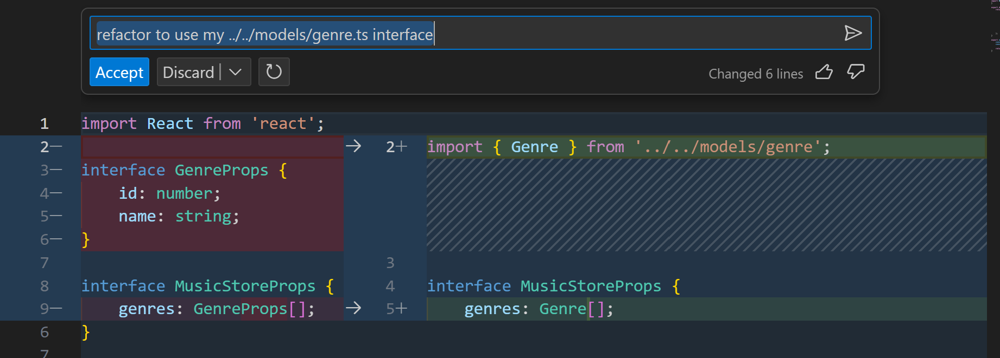

# Step 4: Add a Next.js Page & Display Data

## Add a Landing Page
In this step, we will use GitHub Copilot to add a new page to our Next.js application that displays a list of genres. We will be using the music store API that we created in the previous step.

1. In your Next.js project, locate the `pages` folder, right click and add a new folder named `music-store`, inside the new folder add a new file named `index.tsx`.
2. Ask Copilot Chat for help creating a music store index page that fetches data from an API and displays a list of genres. For example, you could ask: `How do I add a music store index page that displays a list of genres retrieved from the music store genre API endpoint?`
3. Follow the steps suggested by Copilot to create your new page. This should include installing any necessary packages, fetching data from your API, and displaying the data in your component.
4. If something needs changing, why not ask Copilot to do it again but with your suggested changes. 
5. Finally ensure both the Express API & Next.js App are running using `npm run dev`, you should then be able to navigate to the music store landing page in your browser `http://localhost:3000/music-store`.

Remember, you can always ask Copilot for help if you get stuck. For example, you can ask: "How do I fetch data from an API in Next.js?" or "How do I display a list of data in a Next.js page?"

## Add the Models & Refactor Landing Page
For the simplicity of this lab we are going to copy over our models from our API:
1. Under your `src` folder, right click and add a folder `models`.
2. Copy over your `genre.ts`, `artist.ts` and `album.ts` models from your Express API project.
3. Open your `index.tsx` page, then ask Copilot to refactor the page to use your `genre.ts` model. You can select the code block, press `CTRL + I` and ask Copilot, then if you are happy with the suggestion hit `Accept`.

4. Check that your music store landing page loads correctly in the browser.

## Add a Browse Genre Page
Repeat the steps above to add a `browse.tsx` page to the `music-store` folder. The page will read the genre name from the query string, pass it into the albums API endpoint, then display the list of albums. 

You might need to change the URL passed into fetch to match your API, what happens if you tell Copilot the format of the URL? If any of the code generated is incorrect, ask Copilot to fix the issue.

Navigate to the page in your browser and test that it loads, for example navigate to `http://localhost:3000/music-store/browse?genre=Rock`.

## Add an Album Details Page
Finally we want to create an album details page, the page should read the album id from the route, retrieve the album details from the Express API and display the details on the page. You can get started by creating a new file [id].tsx inside a directory named `album`. Your page should display the album title, the album image, as well as artist, genre & price. At this point just use an `` tag for the album image, you will get a lint error, but we will address that later on.

Use what you've learnt above to create this page, then check that it loads in the browser by navigating to the page, for example navigate to `http://localhost:3000/music-store/album/1`.

---------------
[Previous - Add Swagger to the Express API](./03-Step03.md) | [Next - Refactor your Next.js Pages](./05-Step05.md)
