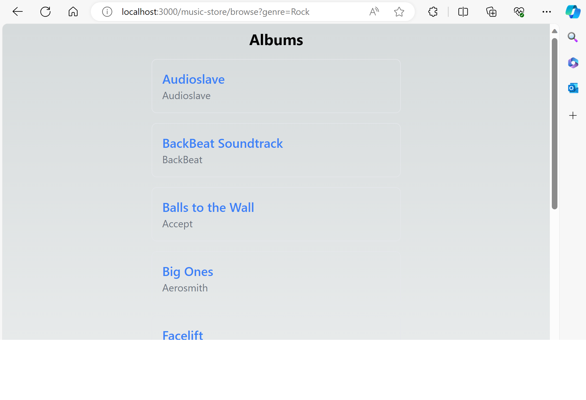
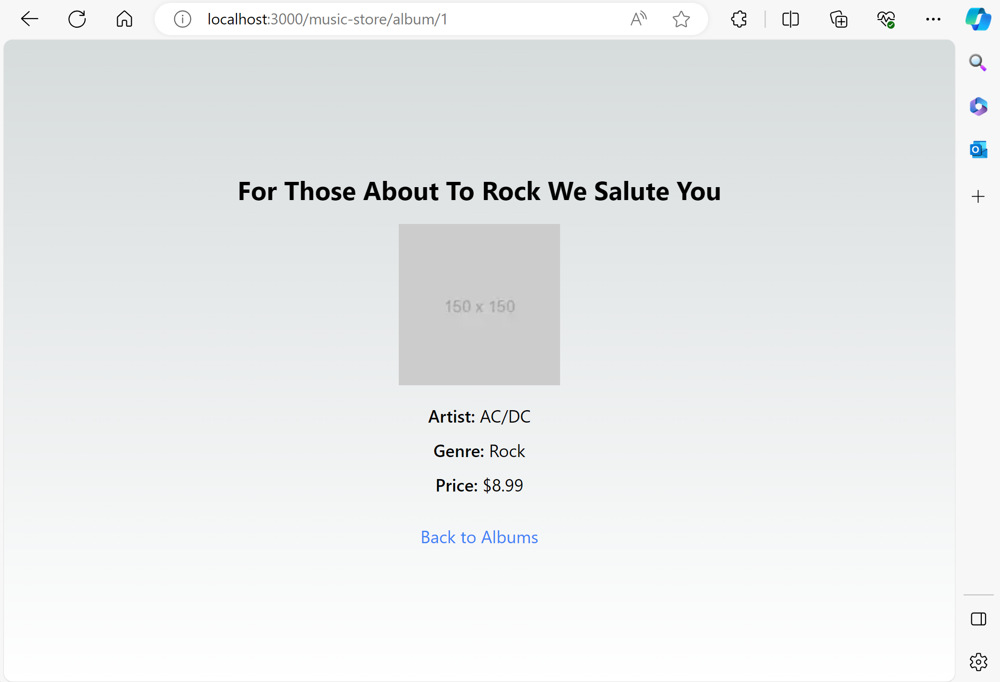

# Step 5: Refactor your Next.js Pages
At this point we have some simple Next.js pages that display data, but we are missing important things like navigation and styling. In this step of the lab we will use Copilot to refactor our pages to fix these issues.

## Refactor Landing Page
1. Open up your landing page `index.tsx` file.
2. Select the `MusicStore` function, press `CTRL + I` and then ask Copilot to make each genre a clickable link that passes the genre name as a query string parameter.
> [!NOTE]
> Make sure the URL is correct and includes the `music-store` path segment. It's also worth pointing out Copilot might generate an `<a>` tag inside the `<Link>`, remove the extra `<a>` tag.
3. Go to Copilot Chat and ask Copilot to make the page look nice using Tailwind CSS styles.
4. Save and view the page in your browser, how does it look? You can continue to iterate, try ask some questions like `Put a max width on the parent container and centre align the content using tailwind css` and see the results in your browser.
5. Iterate until you are happy with the results!

You should end up with a landing page that looks something like this:

## Refactor the Browse Genre Page
Now we will refactor the browse genre page following the same steps as above using Copilot. Here are some of the things we want to achieve:
- Add a message if there are no albums for this genre
- Make each album a clickable link to the album details page
- The page should be nicely styled so it looks good for the users 
- The albums should be displayed in alphabetical order
- There should be a link at the bottom to go back to the landing page

Try a mix of inline Copilot code completion and Copilot Chat to see how they behave. 

You should end up with a browse genre page that looks something like this:

## Refactor the Album Details Page
Finally we will refactor the album details page, we want to achieve the following:
- Add labels for each album property
- Format the price as currency
- Refactor the `` tag to a Next.js `<Image>`. Did you get any errors? Can Copilot Chat help?
- If the fetch returns a 404, the page should load a 404 error
- The page should be nicely styled so it looks good for the users
- There should be a link at the bottom to go back to the browse genre page

Navigate to your Music Store in the browser `http://localhost:3000/music-store` and click around, we have a nice looking example of a Music Store web app!

You should end up with an album details page that looks something like this:

## Next Steps?
At this point we have a functioning Music Store web app, but what changes should we consider before this Next.js could be deployed into production? Ask Copilot chat for some suggestions! Here are some examples of what to ask:
- what changes should I make to my Next.js App before I publish to production?
- How do I replace my hardcoded API URL's in my Next.js App? 
- How do I add error handling to my Next.js App?
- How do I add AzureAD authentication to my Next.js App?

> [!NOTE]
> You can try making the above suggestions in your own time, but they are out of scope for this lab.

---------------
[Previous - Add a Next.js Page & Display Data](./04-Step04.md) | [Next - Adding Unit Tests](./06-Step06.md)